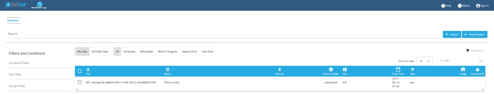

# SciCat frontend configuration 

This file explains how to configure the frontend and is a collection of all the options available.
__IMPORTANT__ : this is a work in progress. Not all the options are listed yet.


## Site Logo related images
A vanilla installation of SciCat uses uses the default site logos which show the SciCat logo with the name of the option to look for if they need to be changed.

Here are the screen shots of the page header and login page:




### Site Header Logo
In order to set the site logo in the header, which is by default the following image:


the option `site_header_logo` can be set to the name of the image file desired.  
The image file should be saved in the folder `src/assets/images/`.  
Example:
```
  "site_header_logo"="scicat_header_logo.png"
```

If SciCat is deployed in a container, the site header logo can be changed mounting the desired image to the path of the default image withouth changing the configuration entry.  
The path to the site header logo image is:
```
  src/assets/images/scicat-header-logo.png
```

A third method is to use both options together, and mounting the image to an arbitrary name under the path `src/assets/images/` in the container and configure the frontend to the selected file name through the configuration option `site_header_logo`

### Site Login Logo
In order to set the site logo in the login page, which is by default the following image:


the option `site_login_logo` can be set to the name of the image file desired.  
The image file should be saved in the folder `src/assets/images/`.  
Example:
```
  "site_login_logo"="scicat_login_logo.png"
```

If SciCat is deployed in a container, the site login logo can be changed mounting the desired image to the path of the default image withouth changing the configuration entry.  
The path to the site login logo image is:
```
  src/assets/images/scicat-login-logo.png
```

A third method is to use both options together, and mounting the image to an arbitrary name under the path `src/assets/images/` in the container and configure the frontend to the selected file name through the configuration option `site_login_logo`

### Site Login Background
In order to set the site background in the login page, which is by default the following image:


the option `site_login_background` can be set to the name of the image file desired.  
The image file should be saved in the folder `src/assets/images/`.  
Example:
```
  "site_login_background"="scicat_login_background.png"
```

If SciCat is deployed in a container, the site login background can be changed mounting the desired image to the path of the default image withouth changing the configuration entry.  
The path to the site login background image is:
```
  src/assets/images/scicat-login-background.png
```

A third method is to use both options together, and mounting the image to an arbitrary name under the path `src/assets/images/` in the container and configure the frontend to the selected file name through the configuration option `site_login_background`

