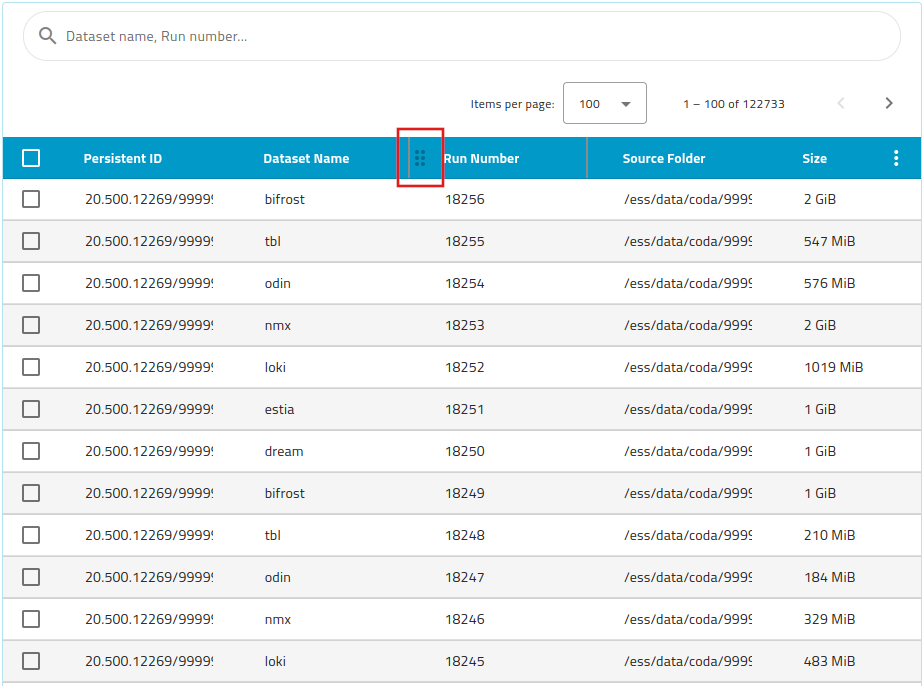
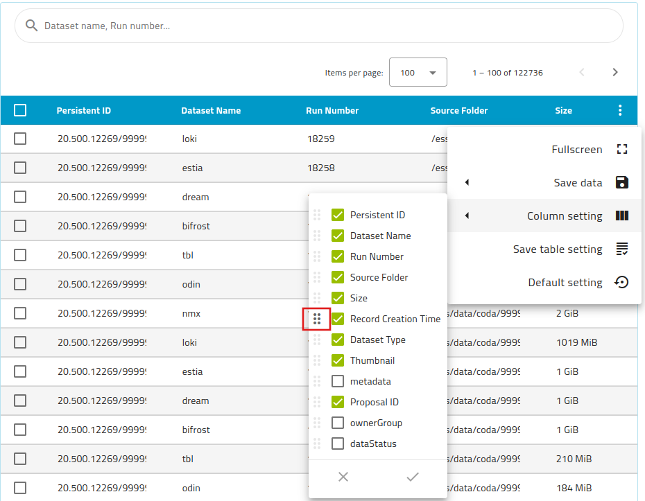
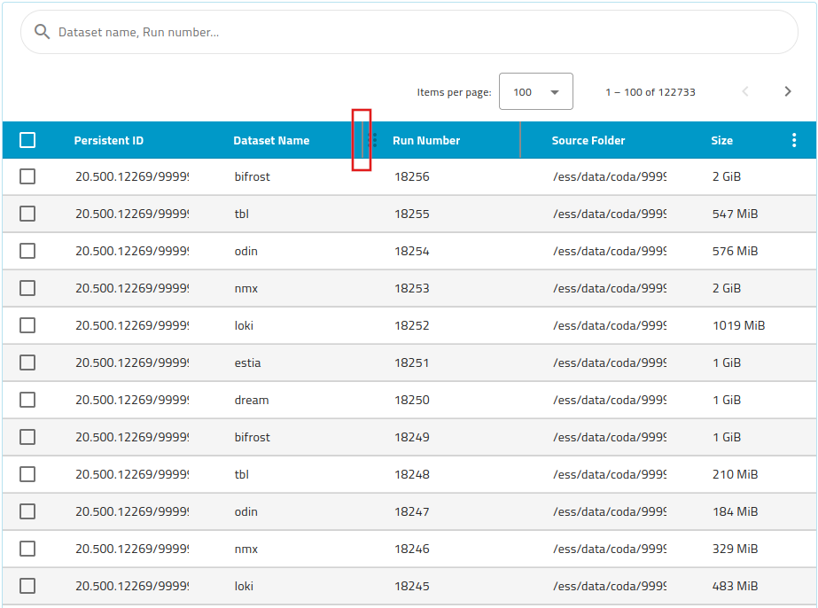
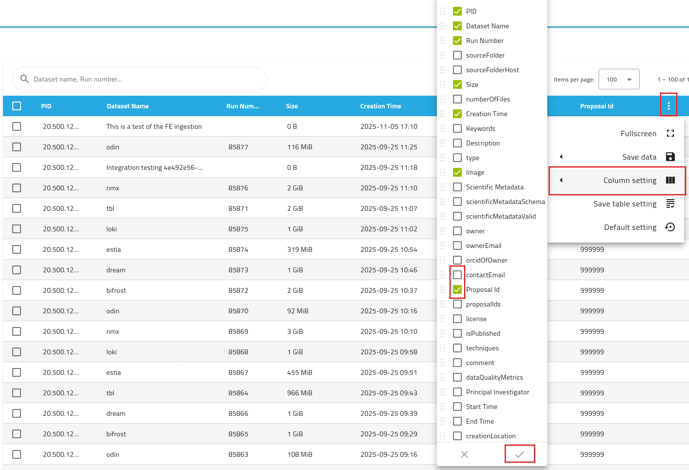
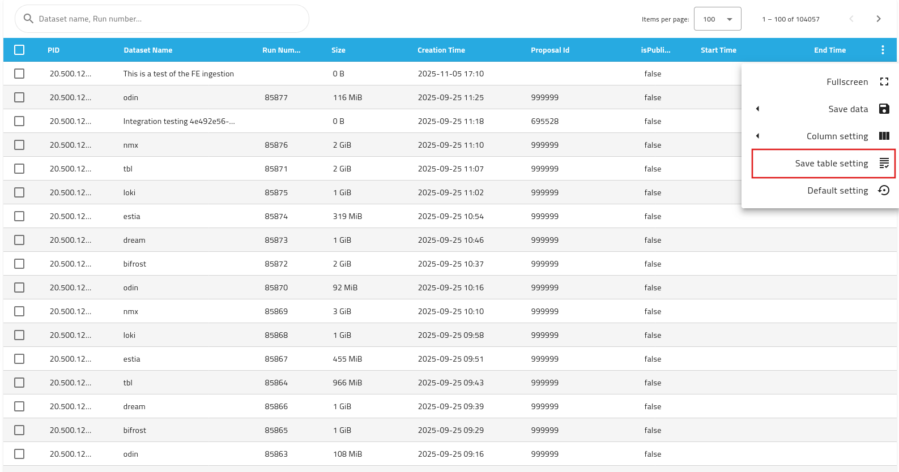
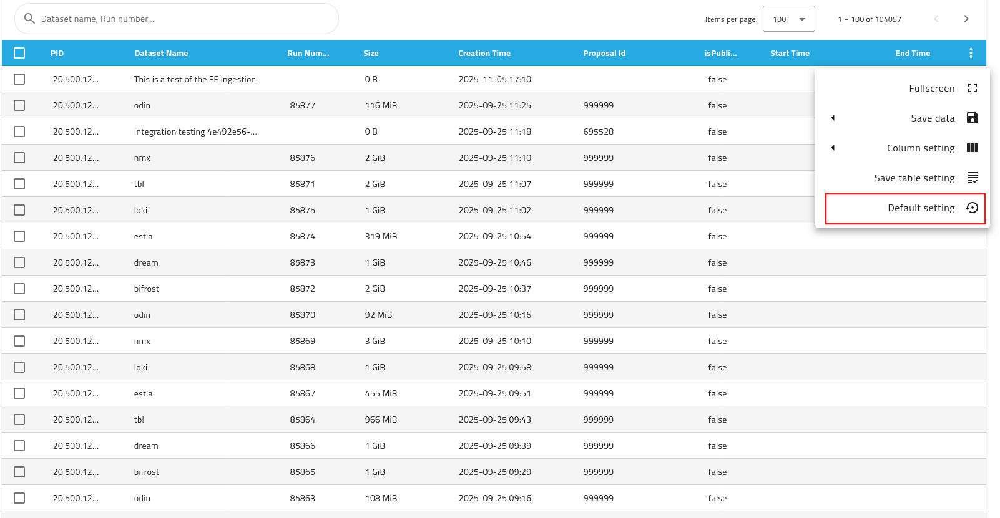
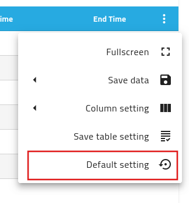
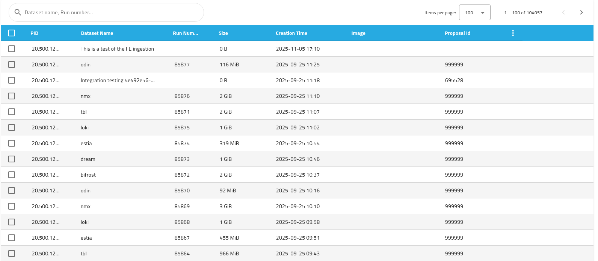
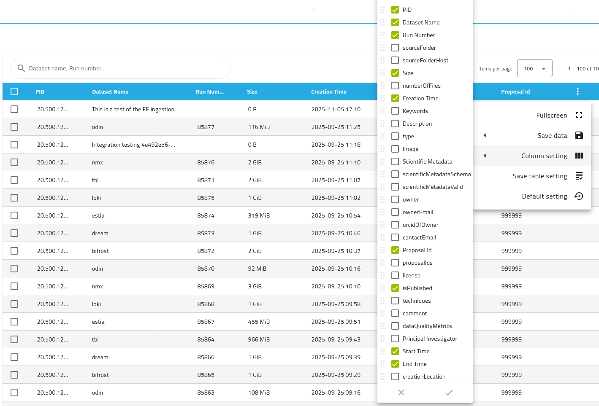
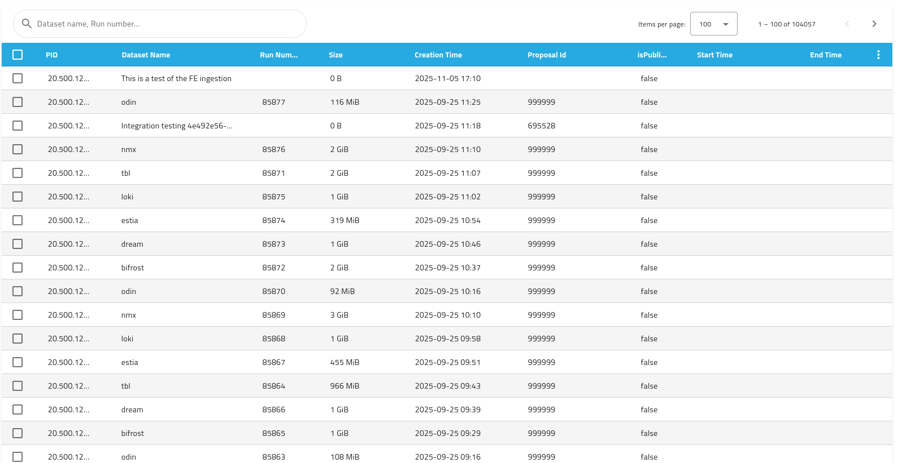

# Customize Datasets List

The datasets list can be fully customized. Users can order the columns, adjust the witdh of each columns and select or hide specific columns to meet their needs.

## Columns Ordering
Columns can be place in any arbitrary order selected by the user.
User can set their columns order by hovering on the columns headers. When the ordering handle appears (See red rectangle in figure 1), the related column can be drag and drop in the correct place.  

  
Figure 1

Alternatively, user can order the columns directly in the column selection menu, accessible through the settings menu (three vertical dots) of the datasets list, as shown in figure 2. Once the columns list is open, hovering on the ordering handle allows the user to drag and drop the column in correct ordering place.

  
_Figure 2_

## Column's width
Columns width can be adjusted buy overing the mouse above the columns headers until the columns delimitation bars are shown.
When the column delimiters are shown, the user can hold and drag the column size as desired, as shown in Figure 3.

_Figure 3_

## Columns' Selection
User can select the columns shown in the datasets list by visiting the columns selection menu. It is accessible by selecting the table settings icon (thre vertical dots), followed by Column Settings.
As shown in Figure 4, the list presents all the configured columns available in the SciCat instance. Here the user can check the columns that are wanted and uncheck the ones that are not needed.  
As highlighted in figure 4 as an example, the field _Contact Email_ is not selected and not shown, while the _Proposal Id_ field is clicked and shown in the list.  
The changes are applied when the confirmation button is clicked. The new settings are manintained and used until the user reload the application or logs out. 

  
_Figure 4_

## Saving settings
If the user would like to re-use the current settings that she has configured, the table settings needs to be saved. 
Saving the settings is achieved byt selecting the table settings (the vertical dots) and clicking on the _Saving settings_, as shown in figure 5 and figure 6.

  
_Figure 5: Save columns settings, full table view._

  
_Figure 6: Save columns settings, menu details_

## Restore default selecting
In case the user would like to restore the original list settings, as they are set by the site admin, she can do so by selecting the table settings menu (the vertical dots) and click on the _Default settings_ option, as shown in Figure 7, and Figure 8. This action will reset the datasets list settings for the current user.

  
_Figure 7: Restore default columns settings, full table view._

  
_Figure 8: REstore default columns settings, menu details._

## User Story - Example
When a user logs in for the first time, the default datasets columns settings are inherited and saved in the database.

_Figure 9: Datasets list default settings_

The user decide to change the columns shown in the datasets list. Click on table settings and select _Column settings_.

_Figure 10_

The user unselect _image_ and select _isPublished_, _Start Time_, and _End Time_.

_Figure 11_

Clicks the apply button. The menu will close and the table will refresh with the new columns shown.

_Figure 12_

Now the user can save her settings for future use by opening the table settings menu and clicking on _Save table settings_ as shown in figure 5 and 6.  
Once the setting sare saved, they will persist across multiple logins for this user.  
  
If the user wants to start fresh, she can restore the default settings byt opening once more the table settings menu and clicking on _Default settings_, as shown in figure 7 and 8.  
This action will bring the datasets table back to the state at first login, like is shown in figure 9.  