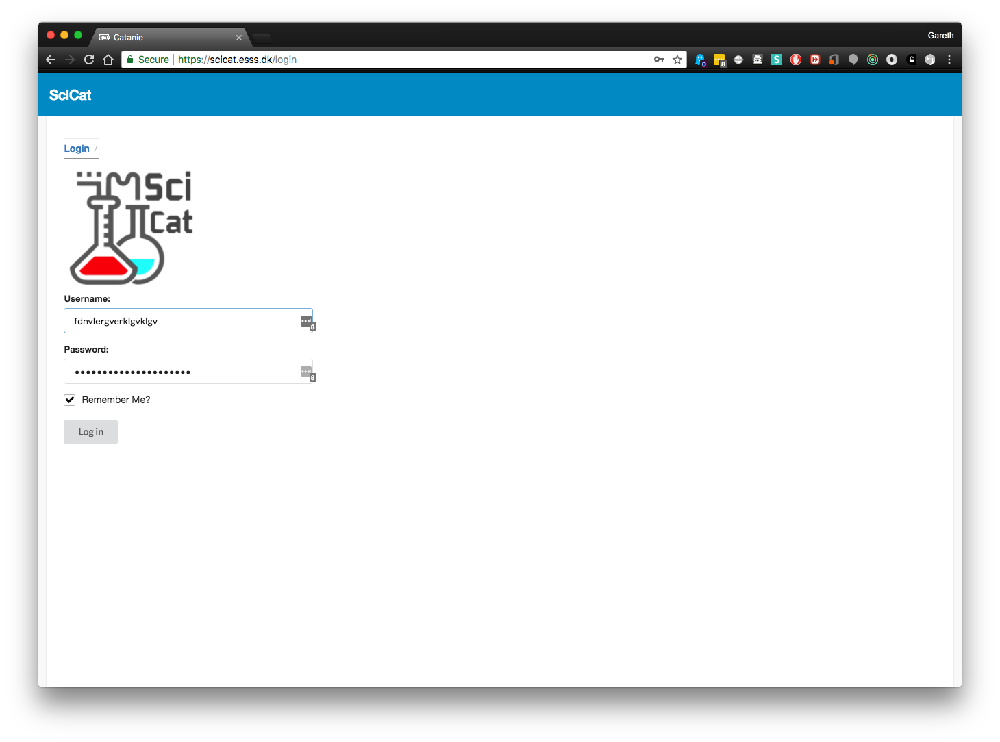
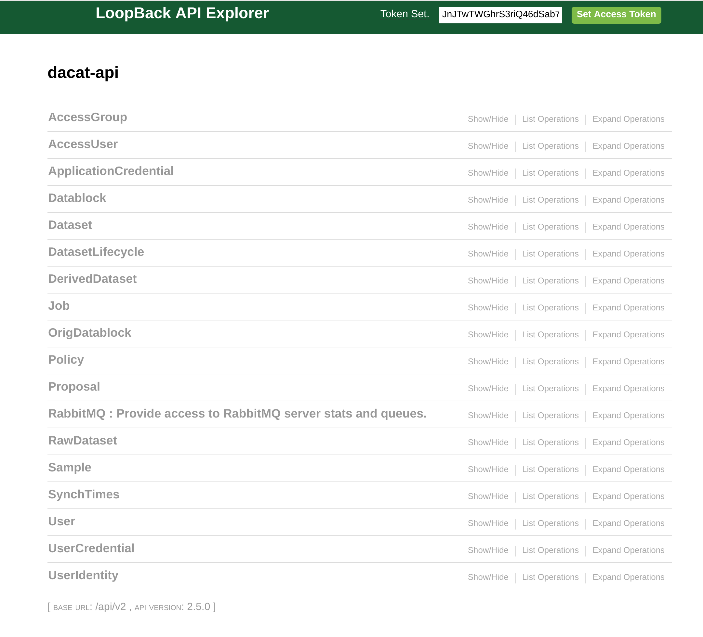

# Instructions 

0. Prerequisites
```
Docker
Git
Make
Web browser
```


1. Install docker & docker-compose 

```
https://docs.docker.com/install/
```
```
https://docs.docker.com/compose/install/#prerequisites
```
2. 
```
git clone https://github.com/SciCatProject/scicat-develop
```

3. 
```
cd scicat-develop
```


4.
Following the instructions in the README.md

```
make

```


```
make run-hot
```


```
make data
```


These commands will install mongoDB which is the scicat database, catamel which is the REST API backend, and finally the frontend web interface (catanie).
In addition random data wikll be generated and added to the database.

5. point your browser to localhost:4200

You should see the scicat interface and be able to login with username ingestor and password 




6. For the backend REST api, you can see the online documentation at localhost:3000/explorer
Instructions for using the loopback API explorer are available at 
https://loopback.io/doc/en/lb3/Use-API-Explorer.html




