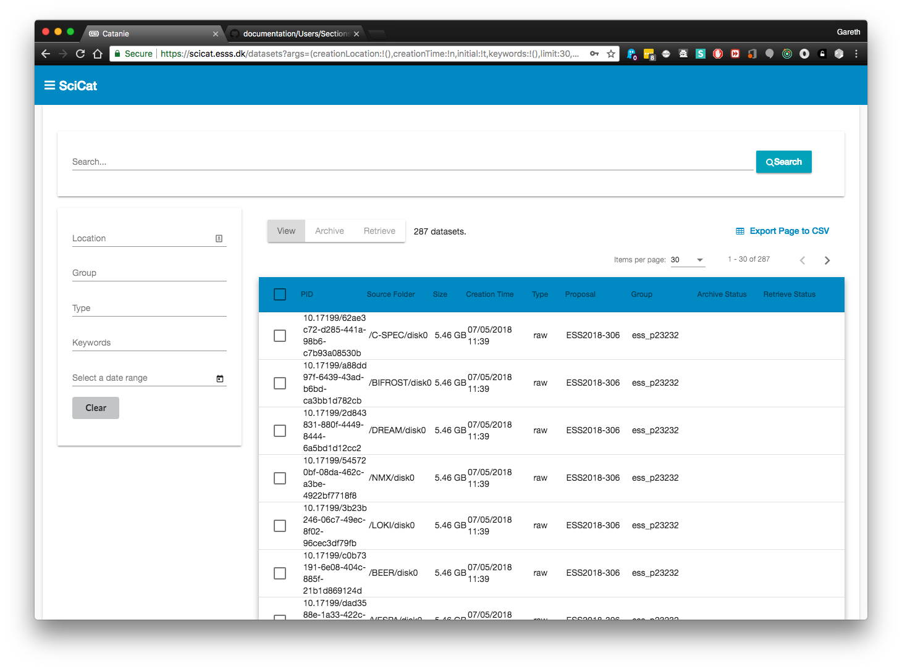
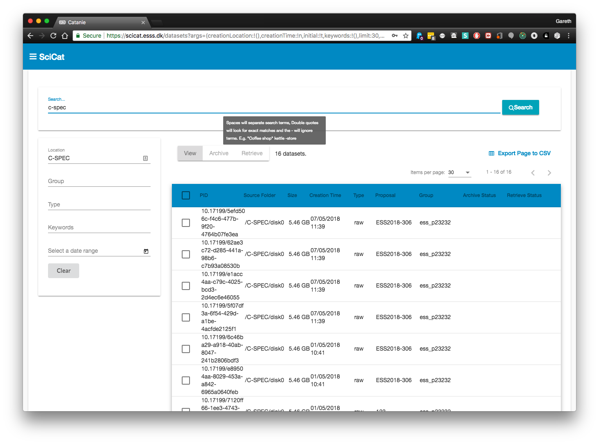

## Dashboard

The main page of the Data Catalog contains an overview of all datasets you have access to.

## Searching

The text field at the top of the screen will search most areas of your Dataset's metadata. If you still cannot find what you need, then the filters on the left hand side will be useful.

## Filtering

You can currently filter across 4 different types:
1. Location (The beamline creationLocation)
2. Groups (The ownerGroup/pGroup that the dataset belongs to)
3. Type - e.g. raw data or derived data
4. Start - End Date (This will show all datasets captured between the dates that you have set)

The text fields provide an auto completion, which becomes visible as you type. If nothing shows, press the down arrow on your keyboard. Most groups start with a 'p' and Beamlines start with a '/'

One click on the date calendar selects the start date and a second selects the end date. Make sure you select 2 dates.

## Viewing

To view a dataset simply click on it in the table and a more detailed view will load (this is covered in the `Dataset Details` section).

## Backups

Selecting a dataset (or datasets) allows you to archive it using the backup system that your institution uses or to retrieve it to your user space.

If a dataset does not have a fixed size, or it has already been archived, then it will not be selectable. Active backup jobs can be seen on the jobs page (covered in the `Jobs` section).

When you select a dataset, it will become checked and you will see details at the bottom of the page. Clicking the `archive` or `retrieve` button will perform that action on the selected datasets

## Paging

At the bottom of the table are arrows for navigation and page numbers. If there are more entries than can fit on the page, more results will be accessible through the pages. Each page will make a call to the server to retrieve more.